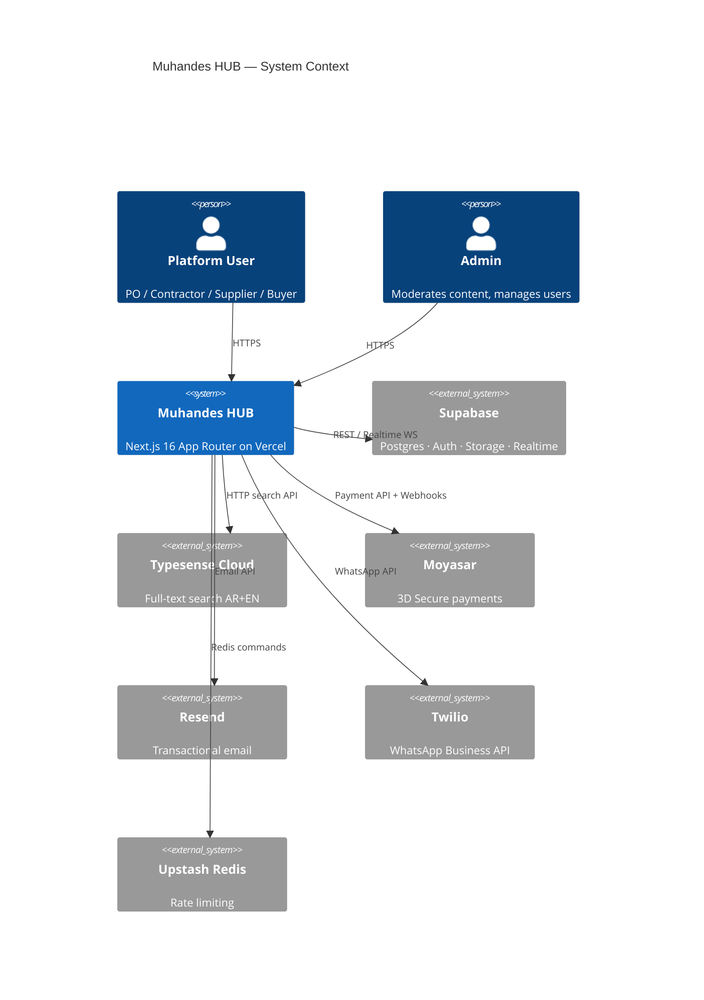
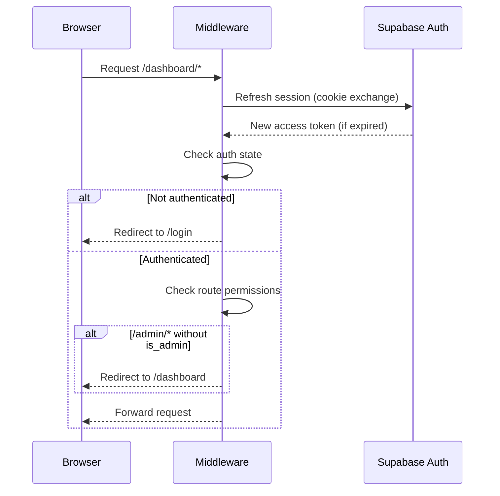
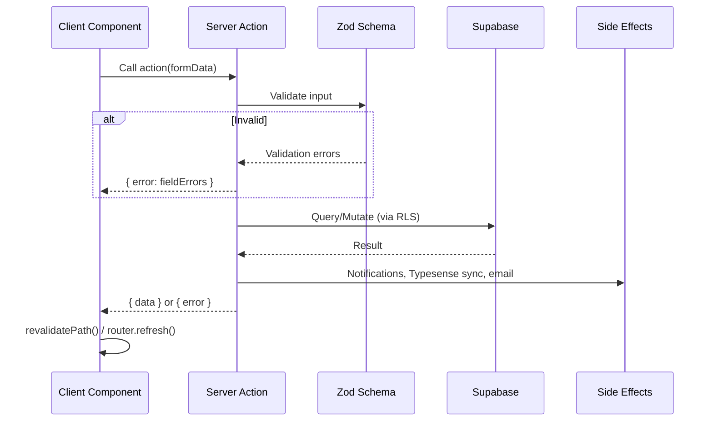
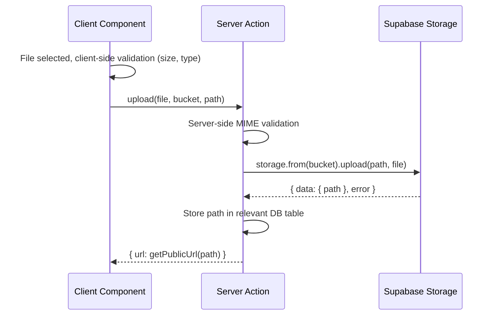
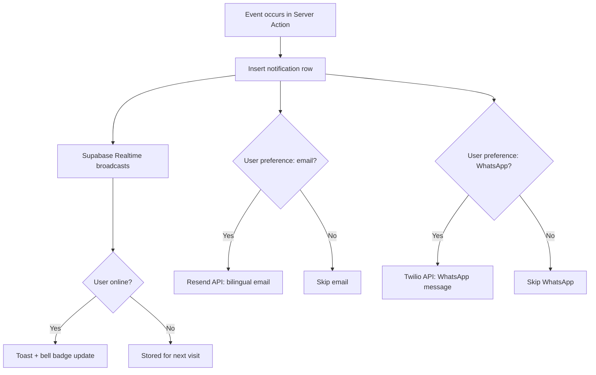
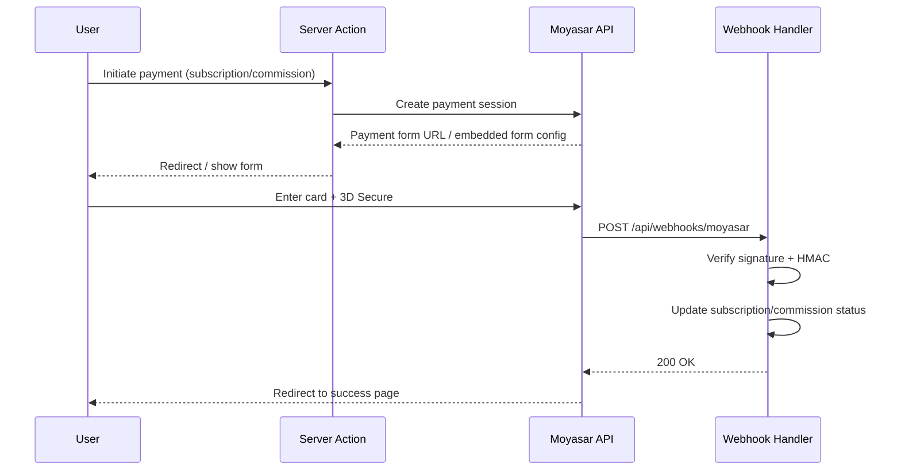
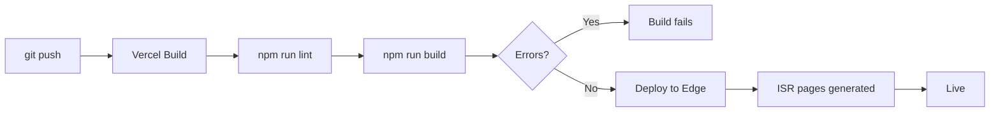

# Muhandes HUB — System Architecture

> **Version**: 1.0 | **Date**: March 4, 2026  
> **Source**: `.docs/FEATURES.md`

---

## 1. High-Level Architecture



### Request Flow Summary

```
Browser → Vercel Edge (middleware.ts)
  ├─ Session refresh (Supabase cookie)
  ├─ Locale detection (AR/EN)
  ├─ Route protection (/dashboard/*, /admin/*)
  └─ Next.js App Router
       ├─ Server Components → Supabase (server client)
       ├─ Server Actions → Supabase (server client) + side effects
       ├─ Client Components → Supabase (browser client) + Realtime
       └─ API Routes → Webhook handlers only
```

---

## 2. Next.js Application Architecture

### 2.1 Route Groups & Pages

```
src/app/
├── layout.tsx                     # Root: <html dir lang>, fonts, metadata, providers
├── page.tsx                       # / → Hero landing
├── globals.css                    # Tailwind v4 @theme inline + tokens
│
├── (public)/                      # No auth required
│   ├── layout.tsx                 # Public header + footer
│   ├── pricing/page.tsx           # Subscription tiers comparison
│   ├── marketplace/page.tsx       # Product browse + Typesense search
│   ├── projects/
│   │   ├── page.tsx               # Project browse + Typesense search
│   │   └── [id]/page.tsx          # Project detail + bid form
│   ├── products/[id]/page.tsx     # Product detail + inquiry form
│   ├── partners/page.tsx          # Verified contractor/supplier directory
│   ├── partners/[id]/page.tsx     # Partner profile with reviews
│   ├── rfqs/
│   │   ├── page.tsx               # RFQ browse
│   │   └── [id]/page.tsx          # RFQ detail + response form
│   ├── contact/page.tsx           # Contact form
│   ├── terms/page.tsx             # Terms of Service AR/EN
│   ├── privacy/page.tsx           # Privacy Policy (PDPL)
│   └── cookies/page.tsx           # Cookie Policy
│
├── (auth)/                        # Auth pages (redirect if logged in)
│   ├── layout.tsx                 # Centered card layout
│   ├── login/page.tsx             # Email/password + Google OAuth
│   ├── register/page.tsx          # Multi-step wizard
│   └── forgot-password/page.tsx   # Reset via email
│
├── (dashboard)/dashboard/         # Authenticated, role-gated
│   ├── layout.tsx                 # Sidebar + topbar layout
│   ├── page.tsx                   # Role-specific overview
│   ├── profile/page.tsx           # Edit profile & company
│   ├── subscription/page.tsx      # Tier management
│   ├── projects/                  # PO & Contractor projects
│   │   ├── page.tsx               # My projects list
│   │   ├── new/page.tsx           # Create project
│   │   └── [id]/
│   │       ├── page.tsx           # Project detail
│   │       ├── edit/page.tsx      # Edit project
│   │       └── bids/page.tsx      # Bids received (PO) / submitted (C)
│   ├── products/                  # Supplier only
│   │   ├── page.tsx               # My products
│   │   ├── new/page.tsx           # Create product
│   │   └── [id]/edit/page.tsx     # Edit product
│   ├── deals/
│   │   ├── page.tsx               # All deals list + filters
│   │   └── [id]/
│   │       ├── page.tsx           # Deal workspace (tabs)
│   │       ├── milestones/page.tsx
│   │       ├── kanban/page.tsx    # Contractor: Kanban board
│   │       ├── daily-log/page.tsx # Contractor: Site logs
│   │       ├── documents/page.tsx # Document vault
│   │       └── contract/page.tsx  # Contract viewer/editor
│   ├── quotations/
│   │   ├── page.tsx               # Quotation list
│   │   ├── new/page.tsx           # Create standalone quotation
│   │   └── [id]/page.tsx          # Quotation detail + PDF
│   ├── rfqs/
│   │   ├── page.tsx               # My RFQs / responses
│   │   └── new/page.tsx           # Create RFQ
│   ├── contracts/
│   │   ├── page.tsx               # Contract list
│   │   └── new/page.tsx           # Create standalone contract
│   ├── crm/
│   │   ├── page.tsx               # CRM dashboard + pipeline
│   │   └── clients/[id]/page.tsx  # Client detail
│   ├── messages/
│   │   ├── page.tsx               # Conversation list
│   │   └── [id]/page.tsx          # Chat thread
│   ├── notifications/page.tsx     # Notification center
│   ├── reviews/page.tsx           # Reviews given & received
│   ├── commissions/page.tsx       # Commission history
│   └── analytics/page.tsx         # Pro+: analytics dashboard
│
├── (admin)/admin/                 # is_admin guard
│   ├── layout.tsx                 # Admin sidebar layout
│   ├── page.tsx                   # Admin overview + stats
│   ├── users/page.tsx             # User list + status management
│   ├── posts/page.tsx             # Post moderation queue
│   ├── deals/page.tsx             # Deal oversight
│   ├── commissions/page.tsx       # Commission verification
│   ├── subscriptions/page.tsx     # Revenue dashboard
│   ├── reviews/page.tsx           # Review moderation
│   ├── settings/page.tsx          # Platform settings
│   └── audit-log/page.tsx         # Audit trail
│
├── verify/
│   └── contract/[id]/page.tsx     # Public contract verification (QR)
│
└── api/                           # Webhook handlers only
    ├── webhooks/
    │   ├── moyasar/route.ts       # Payment confirmation
    │   ├── typesense-sync/route.ts # DB → Typesense sync
    │   └── supabase/route.ts      # DB event webhooks
    └── auth/
        └── callback/route.ts      # Google OAuth callback
```

### 2.2 Server and Client Component Strategy

| Component Type       | When to Use                                                 | Supabase Client                                          |
| -------------------- | ----------------------------------------------------------- | -------------------------------------------------------- |
| **Server Component** | Data fetching, SEO pages, layout shells                     | `createServerClient(cookies())`                          |
| **Server Action**    | All mutations (forms, button actions)                       | `createServerClient(cookies())` or `createAdminClient()` |
| **Client Component** | Interactive UI, hooks, Realtime subscriptions, browser APIs | `createBrowserClient()`                                  |
| **API Route**        | Webhooks from external services, OAuth callback             | `createAdminClient()` (webhooks use service role)        |

**Rule**: Default to Server Components. Add `'use client'` only when the component requires:

- Event handlers (`onClick`, `onChange`, `onSubmit`)
- React hooks (`useState`, `useEffect`, custom hooks)
- Browser APIs (`window`, `document`, `localStorage`)
- Supabase Realtime subscriptions

---

## 3. Supabase Client Architecture

### 3.1 Client Variants

```
src/lib/supabase/
├── client.ts       # createBrowserClient()  — Client Components
├── server.ts       # createServerClient()   — Server Components & Actions
├── admin.ts        # createAdminClient()    — Admin actions & webhooks
└── middleware.ts    # createMiddlewareClient() — Middleware session refresh
```

```typescript
// client.ts — Browser client (singleton)
import { createBrowserClient } from "@supabase/ssr";
import type { Database } from "@/types/database";

export function createClient() {
  return createBrowserClient<Database>(
    process.env.NEXT_PUBLIC_SUPABASE_URL!,
    process.env.NEXT_PUBLIC_SUPABASE_ANON_KEY!,
  );
}

// server.ts — Server client (per-request)
import { createServerClient } from "@supabase/ssr";
import { cookies } from "next/headers";
import type { Database } from "@/types/database";

export async function createClient() {
  const cookieStore = await cookies();
  return createServerClient<Database>(
    process.env.NEXT_PUBLIC_SUPABASE_URL!,
    process.env.NEXT_PUBLIC_SUPABASE_ANON_KEY!,
    {
      cookies: {
        getAll() {
          return cookieStore.getAll();
        },
        setAll(cookiesToSet) {
          cookiesToSet.forEach(({ name, value, options }) =>
            cookieStore.set(name, value, options),
          );
        },
      },
    },
  );
}

// admin.ts — Service role client (NEVER expose to client)
import { createClient } from "@supabase/supabase-js";
import type { Database } from "@/types/database";

export function createAdminClient() {
  return createClient<Database>(
    process.env.NEXT_PUBLIC_SUPABASE_URL!,
    process.env.SUPABASE_SERVICE_ROLE_KEY!,
    { auth: { autoRefreshToken: false, persistSession: false } },
  );
}
```

### 3.2 RLS Strategy

Every table has RLS enabled. Policies follow these patterns:

| Policy Pattern        | Description                                                             |
| --------------------- | ----------------------------------------------------------------------- |
| **Owner read/write**  | `auth.uid() = user_id` — user can CRUD own rows                         |
| **Role-gated insert** | `profiles.role = 'contractor'` joined check                             |
| **Published read**    | `status = 'published'` — anonymous can read published posts             |
| **Deal participant**  | `user_id IN (SELECT buyer_id, seller_id FROM deals WHERE id = deal_id)` |
| **Admin bypass**      | Only via `createAdminClient()` with service role key                    |

### 3.3 Realtime Subscriptions

```typescript
// Channels and events subscribed per feature
const REALTIME_CHANNELS = {
  "deal:{deal_id}": ["milestones", "proofs", "activity_log"],
  "messages:{conversation_id}": ["messages"],
  "notifications:{user_id}": ["notifications"],
  "kanban:{deal_id}": ["kanban_cards"],
} as const;
```

Tables published to Realtime: `messages`, `notifications`, `deals`, `milestones`, `proofs`, `kanban_cards`, `activity_log`.

---

## 4. Authentication Architecture

### 4.1 Auth Providers

| Provider           | Flow            | Notes                            |
| ------------------ | --------------- | -------------------------------- |
| **Email/Password** | Supabase native | Verification email required      |
| **Google OAuth**   | PKCE flow       | Redirect to `/api/auth/callback` |

### 4.2 Session Management



### 4.3 Middleware Logic

```typescript
// src/middleware.ts — Pseudocode
export async function middleware(request: NextRequest) {
  const response = NextResponse.next();
  const supabase = createMiddlewareClient(request, response);

  // 1. Refresh session
  const {
    data: { user },
  } = await supabase.auth.getUser();

  // 2. Locale detection
  const locale = detectLocale(request); // cookie > header > default 'ar'
  response.headers.set("x-locale", locale);

  // 3. Route protection
  const path = request.nextUrl.pathname;

  if (path.startsWith("/dashboard") && !user) {
    return redirect("/login");
  }
  if (path.startsWith("/admin")) {
    if (!user) return redirect("/login");
    const { data: profile } = await supabase
      .from("profiles")
      .select("is_admin")
      .eq("id", user.id)
      .single();
    if (!profile?.is_admin) return redirect("/dashboard");
  }
  if ((path === "/login" || path === "/register") && user) {
    return redirect("/dashboard");
  }

  return response;
}
```

---

## 5. Data Flow Architecture

### 5.1 Server Action Pattern



### 5.2 Server Action Security Layers

Each server action enforces these checks in order:

```
1. Authentication    → getUser() — reject if not logged in
2. Input validation  → Zod schema parse — reject if invalid
3. Role check        → profile.role matches allowed roles
4. Tier limit check  → subscription limits not exceeded
5. Rate limiting     → Upstash Redis sliding window
6. Business logic    → DB query/mutation through RLS
7. Side effects      → Notifications, search index, email
```

---

## 6. Search Architecture

### 6.1 Typesense Integration

```mermaid
flowchart LR
    A[Post published] --> B[DB trigger / webhook]
    B --> C[/api/webhooks/typesense-sync]
    C --> D{Action}
    D --> |INSERT/UPDATE published| E[Upsert document]
    D --> |DELETE or unpublish| F[Remove document]

    G[User searches] --> H[Server Action]
    H --> I{Typesense healthy?}
    I --> |Yes| J[Typesense multi_search]
    I --> |No| K[Fallback: PostgreSQL]
    J --> L[Return faceted results]
    K --> L
```

### 6.2 Typesense Indexes

| Index      | Fields                                                   | Facets                                 | Sort                          |
| ---------- | -------------------------------------------------------- | -------------------------------------- | ----------------------------- |
| `projects` | title_ar, title_en, description_ar, description_en, city | category, city, classification, status | created_at, budget, bid_count |
| `products` | name_ar, name_en, description_ar, description_en         | category, city, pricing_model          | created_at, price, rating     |
| `rfqs`     | title_ar, title_en, description_ar, description_en       | category, city                         | created_at, deadline          |
| `partners` | company_name_ar, company_name_en, bio_ar, bio_en         | role, city, tier, specializations      | rating, total_reviews         |

### 6.3 Fallback Search

```sql
-- PostgreSQL fallback using pg_trgm + tsvector
SELECT *,
  ts_rank(to_tsvector('arabic', title_ar || ' ' || description_ar), query) +
  ts_rank(to_tsvector('english', title_en || ' ' || description_en), query) AS rank
FROM projects
WHERE
  to_tsvector('arabic', title_ar || ' ' || description_ar) @@ query
  OR to_tsvector('english', title_en || ' ' || description_en) @@ query
  OR similarity(title_ar, :search) > 0.3
  OR similarity(title_en, :search) > 0.3
ORDER BY rank DESC;
```

---

## 7. File Upload Architecture

### 7.1 Storage Buckets

| Bucket                   | Max Size | Allowed MIME              | Access                    |
| ------------------------ | -------- | ------------------------- | ------------------------- |
| `avatars`                | 5 MB     | image/\*                  | Public read, owner write  |
| `company-logos`          | 5 MB     | image/\*                  | Public read, owner write  |
| `company-profiles`       | 10 MB    | application/pdf           | Public read, owner write  |
| `verification-documents` | 10 MB    | application/pdf, image/\* | Owner + admin read        |
| `project-files`          | 10 MB    | pdf, dwg, xlsx, docx      | Deal participants         |
| `product-images`         | 5 MB     | image/\*                  | Public read               |
| `product-specs`          | 10 MB    | application/pdf           | Public read               |
| `deal-documents`         | 10 MB    | pdf, image/\*             | Deal participants         |
| `proof-files`            | 10 MB    | image/_, video/_, pdf     | Deal participants         |
| `daily-log-photos`       | 5 MB     | image/\*                  | Deal participants         |
| `message-attachments`    | 10 MB    | \*                        | Conversation participants |
| `contract-pdfs`          | 10 MB    | application/pdf           | Contract parties          |
| `commission-receipts`    | 10 MB    | image/\*, pdf             | Owner + admin             |
| `quotation-pdfs`         | 10 MB    | application/pdf           | Quotation parties         |

### 7.2 Upload Flow



---

## 8. Bilingual (i18n) Architecture

### 8.1 Strategy

**No i18n library** — bilingual handled via:

1. **DB**: Paired fields (`title_ar` / `title_en`) for all user-generated content
2. **UI**: Static text determined by locale context
3. **Locale detection**: Cookie `locale` > `Accept-Language` header > default `ar`
4. **Dir attribute**: `<html dir="rtl" lang="ar">` or `<html dir="ltr" lang="en">`

### 8.2 Locale Provider

```typescript
// src/hooks/use-locale.ts
"use client";
import { createContext, useContext } from "react";

type Locale = "ar" | "en";
type Dir = "rtl" | "ltr";

interface LocaleContext {
  locale: Locale;
  dir: Dir;
  t: (ar: string, en: string) => string; // Simple bilingual text selector
  field: (obj: Record<string, unknown>, key: string) => string; // obj[`${key}_${locale}`]
  switchLocale: () => void;
}

// Usage in components:
// const { t, field, dir } = useLocale()
// <h1>{field(project, 'title')}</h1>    // → project.title_ar or project.title_en
// <p>{t('مرحبا', 'Hello')}</p>          // → locale-based string
```

### 8.3 Tailwind RTL Strategy

```css
/* Use logical properties exclusively */
.card {
  @apply ps-4 pe-6 ms-2 me-auto; /* ✅ Logical */
  /* NEVER: pl-4 pr-6 ml-2 mr-auto */ /* ❌ Physical */
}

/* Directional utilities */
.sidebar {
  @apply start-0 end-auto; /* ✅ */
  /* NEVER: left-0 right-auto */ /* ❌ */
}
```

---

## 9. Component Architecture

### 9.1 Component Hierarchy

```
src/components/
├── ui/                          # Headless/primitive components
│   ├── button.tsx               # Variants: default, outline, ghost, destructive
│   ├── input.tsx                # With label, error, RTL support
│   ├── textarea.tsx
│   ├── select.tsx               # Custom with search
│   ├── modal.tsx                # Dialog with backdrop
│   ├── card.tsx
│   ├── badge.tsx                # Status badges with color coding
│   ├── avatar.tsx
│   ├── tabs.tsx
│   ├── table.tsx                # Sortable, paginated
│   ├── pagination.tsx
│   ├── toast.tsx                # Notification toasts
│   ├── skeleton.tsx             # Loading skeletons
│   ├── file-upload.tsx          # Drag & drop with preview
│   ├── star-rating.tsx          # 1-5 star input/display
│   ├── progress-bar.tsx         # Dual progress for deals
│   └── empty-state.tsx          # Illustrated empty states
│
├── forms/                       # Form components with Zod
│   ├── form-field.tsx           # Label + input + error wrapper
│   ├── form-message.tsx         # Validation error display
│   ├── phone-input.tsx          # +966 prefix locked
│   ├── currency-input.tsx       # SAR formatting
│   ├── city-select.tsx          # Saudi cities dropdown
│   └── rich-text-editor.tsx     # Bilingual text input
│
├── layout/                      # App shell components
│   ├── header.tsx               # Public pages header
│   ├── footer.tsx               # Public pages footer
│   ├── sidebar.tsx              # Dashboard sidebar (role-based)
│   ├── topbar.tsx               # Dashboard top bar
│   ├── mobile-nav.tsx           # Mobile navigation drawer
│   ├── breadcrumbs.tsx
│   ├── locale-switcher.tsx      # AR/EN toggle
│   └── theme-toggle.tsx         # Light/dark mode
│
└── features/                    # Domain-specific composites
    ├── auth/
    │   ├── login-form.tsx
    │   ├── register-wizard.tsx
    │   └── google-auth-button.tsx
    ├── projects/
    │   ├── project-card.tsx
    │   ├── project-form.tsx
    │   └── bid-comparison-table.tsx
    ├── products/
    │   ├── product-card.tsx
    │   ├── product-form.tsx
    │   └── variant-editor.tsx
    ├── deals/
    │   ├── deal-card.tsx
    │   ├── milestone-timeline.tsx
    │   ├── proof-submission.tsx
    │   ├── dual-progress.tsx
    │   └── activity-feed.tsx
    ├── quotations/
    │   ├── quotation-form.tsx
    │   ├── line-item-editor.tsx
    │   └── quotation-pdf.tsx
    ├── kanban/
    │   ├── kanban-board.tsx
    │   ├── kanban-column.tsx
    │   └── kanban-card.tsx
    ├── contracts/
    │   ├── contract-form.tsx
    │   ├── clause-library.tsx
    │   └── signature-pad.tsx
    ├── crm/
    │   ├── pipeline-board.tsx
    │   ├── client-card.tsx
    │   └── interaction-log.tsx
    ├── messaging/
    │   ├── conversation-list.tsx
    │   ├── chat-thread.tsx
    │   └── message-bubble.tsx
    ├── reviews/
    │   └── review-form.tsx
    ├── search/
    │   ├── search-bar.tsx
    │   ├── filter-panel.tsx
    │   └── result-card.tsx
    └── admin/
        ├── moderation-queue.tsx
        ├── user-table.tsx
        └── stats-cards.tsx
```

### 9.2 Design System Tokens

```css
/* src/app/globals.css — @theme inline */
@theme inline {
  --color-primary: #1e40af; /* Blue 800 */
  --color-primary-light: #3b82f6; /* Blue 500 */
  --color-secondary: #f59e0b; /* Amber 500 */
  --color-success: #10b981; /* Emerald 500 */
  --color-danger: #ef4444; /* Red 500 */
  --color-warning: #f59e0b; /* Amber 500 */

  --color-background: #ffffff;
  --color-foreground: #0f172a;
  --color-muted: #64748b;
  --color-border: #e2e8f0;

  --font-sans: "IBM Plex Sans Arabic", "Inter", sans-serif;
  --font-mono: "JetBrains Mono", monospace;

  --radius-sm: 0.375rem;
  --radius-md: 0.5rem;
  --radius-lg: 0.75rem;
  --radius-full: 9999px;
}

@media (prefers-color-scheme: dark) {
  @theme inline {
    --color-background: #0f172a;
    --color-foreground: #f8fafc;
    --color-border: #334155;
    --color-muted: #94a3b8;
  }
}
```

---

## 10. Notification Architecture

### 10.1 Notification Pipeline



### 10.2 Notification Types (24)

| Category         | Types                                                               |
| ---------------- | ------------------------------------------------------------------- |
| **Bids**         | bid_received, bid_shortlisted, bid_awarded, bid_rejected            |
| **Deals**        | deal_created, deal_completed, deal_cancelled                        |
| **Quotations**   | quotation_received, quotation_accepted, quotation_rejected          |
| **RFQ**          | rfq_response_received, rfq_response_accepted, rfq_response_rejected |
| **Hire**         | hire_request_received                                               |
| **Milestones**   | milestone_completed                                                 |
| **Proofs**       | proof_submitted, proof_confirmed, proof_rejected                    |
| **Reviews**      | review_received                                                     |
| **Commission**   | commission_due, commission_overdue                                  |
| **Subscription** | subscription_expiring, subscription_expired                         |
| **Admin**        | document_approved, document_rejected, post_approved, post_rejected  |

---

## 11. Payment Architecture

### 11.1 Moyasar Integration



### 11.2 Payment Types

| Type             | Trigger                               | Amount                         |
| ---------------- | ------------------------------------- | ------------------------------ |
| **Subscription** | Registration (Pro+), renewal, upgrade | Tier price × duration          |
| **Commission**   | Deal completion (Starter 2%, Pro 1%)  | deal_value × rate × 1.15 (VAT) |

---

## 12. Caching Strategy

### 12.1 Next.js Caching Layers

| Layer              | Strategy                                               | TTL        |
| ------------------ | ------------------------------------------------------ | ---------- |
| **Static pages**   | ISR for public pages (pricing, terms)                  | 1 hour     |
| **Dynamic pages**  | No cache — fresh data per request                      | —          |
| **Server Actions** | `revalidatePath()` / `revalidateTag()` after mutations | —          |
| **Typesense**      | Client-side search cache                               | 30 seconds |

### 12.2 Rate Limiting (Upstash Redis)

| Action         | Window | Max Requests |
| -------------- | ------ | ------------ |
| Login attempts | 15 min | 5            |
| Bid submission | 1 min  | 3            |
| RFQ creation   | 1 hour | 10           |
| Message send   | 1 min  | 20           |
| File upload    | 1 min  | 5            |
| Contact form   | 1 hour | 3            |

```typescript
// src/lib/rate-limit.ts
import { Ratelimit } from "@upstash/ratelimit";
import { Redis } from "@upstash/redis";

const redis = Redis.fromEnv();

export const rateLimits = {
  login: new Ratelimit({ redis, limiter: Ratelimit.slidingWindow(5, "15 m") }),
  bid: new Ratelimit({ redis, limiter: Ratelimit.slidingWindow(3, "1 m") }),
  rfq: new Ratelimit({ redis, limiter: Ratelimit.slidingWindow(10, "1 h") }),
  message: new Ratelimit({
    redis,
    limiter: Ratelimit.slidingWindow(20, "1 m"),
  }),
  upload: new Ratelimit({ redis, limiter: Ratelimit.slidingWindow(5, "1 m") }),
  contact: new Ratelimit({ redis, limiter: Ratelimit.slidingWindow(3, "1 h") }),
};
```

---

## 13. Error Handling Strategy

### 13.1 Error Boundaries

```
src/app/
├── error.tsx          # Global error boundary
├── not-found.tsx      # Global 404
├── (dashboard)/
│   └── dashboard/
│       ├── error.tsx  # Dashboard error boundary
│       └── loading.tsx
└── (admin)/
    └── admin/
        └── error.tsx  # Admin error boundary
```

### 13.2 Server Action Error Pattern

```typescript
// Standard return type for all server actions
type ActionResult<T = void> =
  | { data: T; error: null }
  | { data: null; error: string; fieldErrors?: Record<string, string[]> };

// Usage
export async function createProject(
  formData: FormData,
): Promise<ActionResult<{ id: string }>> {
  // 1. Auth check
  const user = await getAuthUser();
  if (!user) return { data: null, error: "Unauthorized" };

  // 2. Validate
  const parsed = projectSchema.safeParse(Object.fromEntries(formData));
  if (!parsed.success)
    return {
      data: null,
      error: "Validation failed",
      fieldErrors: parsed.error.flatten().fieldErrors,
    };

  // 3. Execute
  try {
    const { data, error } = await supabase
      .from("projects")
      .insert(parsed.data)
      .select()
      .single();
    if (error) throw error;
    return { data: { id: data.id }, error: null };
  } catch (e) {
    console.error("createProject failed:", e);
    return { data: null, error: "Failed to create project" };
  }
}
```

---

## 14. Security Architecture

### 14.1 Security Layers

```
Layer 1: Vercel Edge          → DDoS protection, SSL termination
Layer 2: Next.js Middleware   → Auth session, route protection
Layer 3: Server Action        → Auth + role + tier + rate limit checks
Layer 4: Supabase RLS         → Row-level security on every query
Layer 5: DB Triggers          → Business rule enforcement
Layer 6: Input Validation     → Zod schemas (client + server)
```

### 14.2 Environment Variable Security

| Variable                           | Exposure        | Usage                           |
| ---------------------------------- | --------------- | ------------------------------- |
| `NEXT_PUBLIC_SUPABASE_URL`         | Client + Server | API endpoint                    |
| `NEXT_PUBLIC_SUPABASE_ANON_KEY`    | Client + Server | Public API key (RLS enforced)   |
| `SUPABASE_SERVICE_ROLE_KEY`        | **Server only** | Admin operations — bypasses RLS |
| `SUPABASE_DB_PASSWORD`             | **Server only** | Direct DB access (migrations)   |
| `RESEND_API_KEY`                   | **Server only** | Email sending                   |
| `MOYASAR_SECRET_KEY`               | **Server only** | Payment API                     |
| `TYPESENSE_API_KEY`                | **Server only** | Search admin key                |
| `NEXT_PUBLIC_TYPESENSE_SEARCH_KEY` | Client + Server | Search-only key                 |
| `UPSTASH_REDIS_REST_URL`           | **Server only** | Rate limiting                   |
| `UPSTASH_REDIS_REST_TOKEN`         | **Server only** | Rate limiting                   |
| `TWILIO_*`                         | **Server only** | WhatsApp API                    |

### 14.3 CSRF & XSS Protection

- **Server Actions**: Next.js built-in CSRF protection (origin check)
- **API Routes**: Verify webhook signatures (HMAC)
- **XSS**: React auto-escapes, Zod sanitizes inputs, CSP headers via `next.config.ts`
- **File uploads**: Server-side MIME validation, size limits, no executable types

---

## 15. Deployment Architecture

### 15.1 Vercel Configuration

```
Production:  main branch → vercel.com
Preview:     PR branches → preview deployments
Environment: Vercel env vars (encrypted)
Region:      me-south-1 (Bahrain) — closest to Saudi Arabia
```

### 15.2 Build Pipeline



### 15.3 Infrastructure Diagram

```
┌─────────────────────────────────────────┐
│              Vercel Edge                 │
│  ┌────────────────────────────────────┐  │
│  │     Next.js 16 App Router         │  │
│  │  ┌──────────┐  ┌───────────────┐  │  │
│  │  │  Server   │  │    Client     │  │  │
│  │  │Components │  │  Components   │  │  │
│  │  └─────┬─────┘  └──────┬───────┘  │  │
│  │        │                │          │  │
│  │  ┌─────▼─────┐  ┌──────▼───────┐  │  │
│  │  │  Server   │  │   Browser    │  │  │
│  │  │  Actions  │  │   Client     │  │  │
│  │  └─────┬─────┘  └──────┬───────┘  │  │
│  └────────┼────────────────┼─────────┘  │
└───────────┼────────────────┼────────────┘
            │                │
    ┌───────▼────────────────▼──────────┐
    │         Supabase Cloud            │
    │  ┌──────────┐  ┌──────────────┐   │
    │  │ PostgreSQL│  │   Auth       │   │
    │  │  + RLS    │  │  (JWT)       │   │
    │  └──────────┘  └──────────────┘   │
    │  ┌──────────┐  ┌──────────────┐   │
    │  │ Storage  │  │  Realtime    │   │
    │  │ (S3)     │  │  (WebSocket) │   │
    │  └──────────┘  └──────────────┘   │
    └───────────────────────────────────┘
            │
    ┌───────▼───────────────────────────┐
    │       External Services           │
    │  Typesense · Moyasar · Resend     │
    │  Twilio · Upstash Redis           │
    └───────────────────────────────────┘
```

---

## 16. Monitoring & Observability

| Concern            | Tool                           | Notes                              |
| ------------------ | ------------------------------ | ---------------------------------- |
| **Error tracking** | Vercel Error Monitoring        | Auto-capture server errors         |
| **Analytics**      | Vercel Analytics               | Web Vitals, page views             |
| **DB monitoring**  | Supabase Dashboard             | Query performance, connection pool |
| **Uptime**         | Vercel / Supabase built-in     | Automatic health checks            |
| **Audit log**      | Custom `admin_audit_log` table | All admin actions logged           |
| **Search metrics** | Typesense Dashboard            | Query latency, popular searches    |
