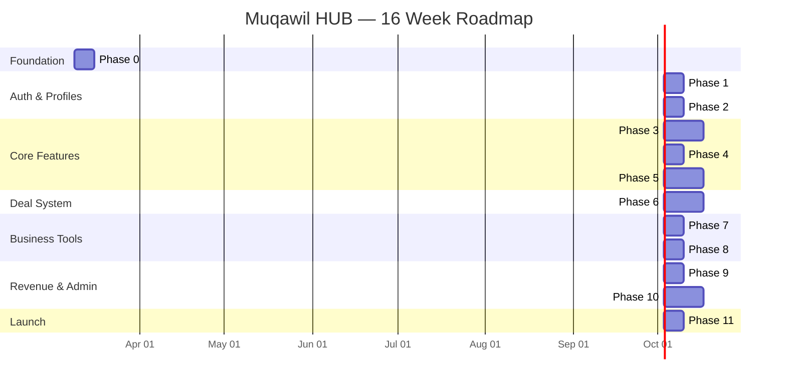

# Muqawil HUB — Implementation Roadmap

> **Version**: 1.0 | **Date**: March 4, 2026  
> **Total Duration**: ~16 weeks (4 months) | **11 Phases**  
> **Source**: `.docs/FEATURES.md`

---

## Phase Overview

| Phase  | Name                                    | Duration   | Dependencies                    |
| ------ | --------------------------------------- | ---------- | ------------------------------- |
| **0**  | Foundation & Infrastructure             | Week 1     | —                               |
| **1**  | Authentication & Registration           | Week 2     | Phase 0                         |
| **2**  | Core Profiles & Subscriptions           | Week 3     | Phase 1                         |
| **3**  | Projects & Products (CRUD + Moderation) | Weeks 4–5  | Phase 2                         |
| **4**  | Bidding & Comparison                    | Week 6     | Phase 3                         |
| **5**  | Quotations & RFQs                       | Weeks 7–8  | Phase 3                         |
| **6**  | Deal Workspace & Milestones             | Weeks 9–10 | Phase 4/5                       |
| **7**  | Contracts, CRM & Kanban                 | Week 11    | Phase 6                         |
| **8**  | Messaging & Notifications               | Week 12    | Phase 2 (can parallel with 5–7) |
| **9**  | Reviews, Commissions & Payments         | Week 13    | Phase 6                         |
| **10** | Search, Admin Panel & Analytics         | Week 14–15 | All prior phases                |
| **11** | Polish, Testing & Launch                | Week 16    | All phases                      |

---

## Phase 0 — Foundation & Infrastructure (Week 1)

### Goals

Set up the development environment, install all dependencies, configure Supabase, establish project structure, and create the design system foundation.

### Tasks

#### 0.1 Dependencies & Tooling

- [x] Install core packages: `@supabase/supabase-js`, `@supabase/ssr`, `zod`
- [x] Install UI packages: `clsx`, `tailwind-merge`, `lucide-react`
- [x] Install integration packages: `typesense`, `@upstash/redis`, `@upstash/ratelimit`
- [x] Configure ESLint flat config with TypeScript strict rules
- [x] Verify `tsconfig.json` strict mode + path aliases (`@/*`)

#### 0.2 Database Setup

- [x] Run `docs/DATABASE.sql` in Supabase SQL Editor (all tables, ENUMs, triggers, RLS, seed data)
- [x] Generate TypeScript types: `npx supabase gen types typescript --project-id <id> > src/types/database.ts`
- [x] Verify RLS policies with test queries
- [x] Configure Supabase Realtime publications on required tables
- [x] Create Storage buckets (14 buckets as documented)
- [x] Set Storage bucket policies (MIME types, size limits)

#### 0.3 Supabase Client Setup

- [x] Create `src/lib/supabase/client.ts` — browser client
- [x] Create `src/lib/supabase/server.ts` — server client
- [x] Create `src/lib/supabase/admin.ts` — service role client
- [x] Create `src/lib/supabase/middleware.ts` — middleware client

#### 0.4 Project Structure

- [x] Create folder structure: `components/ui/`, `components/forms/`, `components/layout/`, `components/features/`
- [x] Create folder structure: `lib/`, `actions/`, `hooks/`, `types/`, `schemas/`
- [x] Create `src/lib/utils.ts` — `cn()`, `formatSAR()`, `formatPhone()`, `getLocaleField()`
- [x] Create `src/types/enums.ts` — TypeScript enums matching DB enums
- [x] Create `src/types/index.ts` — re-exports + derived types

#### 0.5 Design System & Layout

- [x] Update `globals.css` with full `@theme inline` tokens (colors, fonts, radii, dark mode)
- [x] Build primitive components: `Button`, `Input`, `Textarea`, `Card`, `Badge`, `Modal`, `Skeleton`, `Toast`
- [x] Build `src/components/forms/form-field.tsx` — label + input + error wrapper
- [x] Build `src/components/forms/phone-input.tsx` — locked +966 prefix
- [x] Build `src/components/forms/currency-input.tsx` — SAR formatting
- [x] Build `src/components/forms/city-select.tsx` — Saudi cities from DB
- [x] Install Arabic font (IBM Plex Sans Arabic) + English font (Inter) via `next/font`

#### 0.6 Layout Shell

- [x] Create root `layout.tsx` with locale provider, `dir` attribute, fonts, metadata
- [x] Create `(public)/layout.tsx` with Header + Footer
- [x] Create `(auth)/layout.tsx` with centered card
- [x] Create `(dashboard)/dashboard/layout.tsx` with Sidebar + Topbar
- [x] Build `Sidebar` component with role-based navigation
- [x] Build `Header` component with locale switcher
- [x] Build `Footer` component
- [x] Build `LocaleSwitcher` component

#### 0.7 Middleware

- [x] Create `src/middleware.ts` — session refresh, locale detection, route protection
- [x] Configure matcher for `/dashboard/*`, `/admin/*`, `/login`, `/register`

### Deliverables

- Fully configured project with all dependencies
- Database schema deployed to Supabase
- Supabase clients working (browser, server, admin, middleware)
- Design system primitives ready
- App shell with all 4 layout groups
- Middleware protecting routes

---

## Phase 1 — Authentication & Registration (Week 2)

### Goals

Complete auth flow including email/password registration, Google OAuth, multi-step registration wizard, email verification, and login.

### Tasks

#### 1.1 Auth Schemas

- [x] Create `src/schemas/auth.ts` — `RegisterSchema`, `LoginSchema`, `ResetPasswordSchema`, `UpdatePasswordSchema`
- [x] Phone validation: `+966` regex
- [x] PDPL consent boolean required

#### 1.2 Auth Actions

- [x] Create `src/actions/auth.ts` — `register`, `login`, `loginWithGoogle`, `logout`, `resetPassword`, `updatePassword`
- [x] Rate limiting on login (5/15min) and registration (3/hour)

#### 1.3 Registration Wizard

- [x] Build `src/components/features/auth/register-wizard.tsx` — multi-step form
- [x] Step 1: Role selection (4 cards with descriptions)
- [x] Step 2: Account details (email, password, phone, PDPL)
- [x] Step 3: Company/Personal profile (conditional fields)
- [x] Step 4: Subscription selection (Starter free, Pro/Business/Enterprise paid)
- [ ] Step 5: Payment (Moyasar integration — skip for Starter)
- [ ] Step 6: Document upload (skip for PO/Buyer/Starter)
- [x] Progress indicator showing current step

#### 1.4 Login & Recovery

- [x] Build `src/app/(auth)/login/page.tsx` — email/password + Google button
- [x] Build `src/app/(auth)/register/page.tsx` — wizard host
- [x] Build `src/app/(auth)/forgot-password/page.tsx` — email input
- [x] Build `src/components/features/auth/google-auth-button.tsx`

#### 1.5 OAuth Callback

- [x] Create `src/app/api/auth/callback/route.ts` — code exchange + redirect
- [x] Handle new Google users (redirect to Step 1 for role selection)

#### 1.6 Email Verification

- [ ] Configure Supabase email templates (bilingual AR/EN)
- [x] Handle verification redirect back to app

### Deliverables

- Full registration flow for all 4 roles × all tiers
- Login with email/password and Google OAuth
- Password reset flow
- Email verification working
- Rate limiting active

---

## Phase 2 — Core Profiles & Subscriptions (Week 3)

### Goals

Profile management, subscription system with Moyasar payments, coupon system, and the dashboard overview page.

### Tasks

#### 2.1 Profile

- [x] Create `src/schemas/subscription.ts`
- [x] Build `src/app/(dashboard)/dashboard/profile/page.tsx`
- [x] Profile edit form with bilingual fields, avatar upload, company logo
- [x] Verification document upload (Pro+ accounts)
- [x] `updateProfile` action with file handling

#### 2.2 Subscription Management

- [x] Create `src/actions/subscriptions.ts` — `subscribe`, `upgradeSubscription`, `downgradeSubscription`, `renewSubscription`, `applyCoupon`
- [x] Build `src/app/(dashboard)/dashboard/subscription/page.tsx`
- [x] Current tier display with usage stats (bids used, products posted, etc.)
- [x] Upgrade/downgrade/renew UI
- [x] Coupon input and validation
- [ ] Moyasar payment integration for subscriptions

#### 2.3 Hooks

- [x] Create `src/hooks/use-auth.ts` — session state management
- [x] Create `src/hooks/use-locale.ts` — AR/EN switching, `t()`, `field()`
- [x] Create `src/hooks/use-subscription.ts` — current tier + limit checking

#### 2.4 Dashboard Overview

- [x] Build `src/app/(dashboard)/dashboard/page.tsx` — role-specific overview
- [x] PO: active projects, pending bids, active deals
- [x] Contractor: available projects, submitted bids, active deals, Kanban shortcut
- [x] Supplier: products, inquiries, RFQs, active deals
- [x] Buyer: marketplace shortcut, RFQs, active deals
- [x] Onboarding checklist component (if profile incomplete)

#### 2.5 Public Pages

- [x] Build `src/app/(public)/pricing/page.tsx` — tier comparison table
- [x] Build `src/app/(public)/contact/page.tsx` — contact form + `submitContactForm` action
- [x] Build `src/app/(public)/terms/page.tsx`, `privacy/page.tsx`, `cookies/page.tsx`

### Deliverables

- Profile viewing and editing with file uploads
- Subscription management with real Moyasar payments
- Coupon system
- Dashboard overview for all roles
- Public pages (pricing, contact, legal)

---

## Phase 3 — Projects & Products (Weeks 4–5)

### Goals

Full CRUD for project posts (PO/Contractor) and product listings (Supplier) with admin moderation workflow, file uploads, and public browse pages.

### Tasks

#### 3.1 Project CRUD (Week 4)

- [x] Create `src/schemas/project.ts`
- [x] Create `src/actions/projects.ts` — `createProject`, `updateProject`, `submitProjectForApproval`, `deleteProject`
- [x] Build `src/app/(dashboard)/dashboard/projects/page.tsx` — my projects list with status badges
- [x] Build `src/app/(dashboard)/dashboard/projects/new/page.tsx` — project form (bilingual, category, city, budget, timeline, files)
- [x] Build `src/app/(dashboard)/dashboard/projects/[id]/page.tsx` — project detail
- [x] Build `src/app/(dashboard)/dashboard/projects/[id]/edit/page.tsx` — edit form (draft/rejected only)
- [x] File upload to `project-files` bucket (BOQ, drawings, specs)

#### 3.2 Product CRUD (Week 4)

- [x] Create `src/schemas/product.ts`
- [x] Create `src/actions/products.ts` — `createProduct`, `updateProduct`, `submitProductForApproval`, `deleteProduct`, `bulkImportProducts`
- [x] Build `src/app/(dashboard)/dashboard/products/page.tsx` — my products + tier limit indicator
- [x] Build `src/app/(dashboard)/dashboard/products/new/page.tsx` — product form with variants, images, specs
- [x] Build `src/components/features/products/variant-editor.tsx` — dynamic variant rows (SKU, price, stock)
- [x] Image gallery upload to `product-images`
- [x] Spec sheet upload to `product-specs`
- [x] CSV bulk import (Business+ only)

#### 3.3 Public Browse (Week 5)

- [x] Build `src/app/(public)/projects/page.tsx` — browse published projects (placeholder search, filters)
- [x] Build `src/app/(public)/projects/[id]/page.tsx` — project detail public view
- [x] Build `src/app/(public)/marketplace/page.tsx` — browse published products
- [x] Build `src/app/(public)/products/[id]/page.tsx` — product detail + inquiry form
- [x] Build `src/app/(public)/partners/page.tsx` — contractor/supplier directory
- [x] Build `src/app/(public)/partners/[id]/page.tsx` — partner profile with reviews

#### 3.4 Post Status Components

- [x] Build status badge component (Draft → Pending → Published → Awarded/Completed/Rejected)
- [x] Build moderation feedback display (rejection reason AR/EN)
- [x] Build empty state components for all list pages

### Deliverables

- Project CRUD with file uploads and moderation workflow
- Product CRUD with variants, images, and CSV import
- Public browse pages for projects, marketplace, partners
- Draft → Pending → Published workflow working end-to-end

---

## Phase 4 — Bidding & Comparison (Week 6)

### Goals

Bid submission by contractors, bid comparison table for project owners, bid award → deal creation.

### Tasks

#### 4.1 Bid System

- [x] Create `src/schemas/bid.ts`
- [x] Create `src/actions/bids.ts` — `submitBid`, `updateBid`, `shortlistBid`, `awardBid`, `rejectBid`
- [x] Bid form on project detail page (amount, timeline, methodology, attachments)
- [x] Tier limit enforcement (monthly bid count)
- [x] Classification check (contractor classification ≥ project classification)
- [x] Rate limiting (3/min)

#### 4.2 Bid Comparison

- [x] Build `src/app/(dashboard)/dashboard/projects/[id]/bids/page.tsx`
- [x] Build `src/components/features/projects/bid-comparison-table.tsx`
- [x] Side-by-side: price, timeline, contractor rating, tier, methodology
- [x] Shortlist / Award / Reject actions inline

#### 4.3 Deal Creation Trigger

- [x] `awardBid` → auto-create `DEAL-PROJECT` deal
- [x] Auto-reject all other bids
- [x] Notifications: `bid_awarded`, `bid_rejected` (others), `deal_created`

### Deliverables

- Contractors can submit bids with tier limits enforced
- POs can compare, shortlist, and award bids
- Bid award auto-creates a deal

---

## Phase 5 — Quotations & RFQs (Weeks 7–8)

### Goals

Complete quotation system (inquiry response + standalone), RFQ workflow, direct hire request, all leading to deal creation.

### Tasks

#### 5.1 Quotation System (Week 7)

- [x] Create `src/schemas/quotation.ts`
- [x] Create `src/actions/quotations.ts` — `createQuotation`, `sendQuotation`, `acceptQuotation`, `rejectQuotation`, `duplicateQuotation`, `generateQuotationPDF`
- [x] Build `src/app/(dashboard)/dashboard/quotations/page.tsx` — quotation list
- [x] Build `src/app/(dashboard)/dashboard/quotations/new/page.tsx` — create form
- [x] Build `src/components/features/quotations/line-item-editor.tsx` — dynamic line items
- [x] Auto-numbering: QTN-YYYY-NNNN per company
- [x] VAT calculation (15% auto-added)
- [ ] Clause library selection
- [ ] PDF generation (bilingual)
- [x] Send via Resend email
- [x] Accept quotation → create deal

#### 5.2 Inquiry Flow (Week 7)

- [x] Product inquiry form on product detail page
- [x] Inquiry → Quotation (Mode A) linking
- [x] Supplier notification on inquiry

#### 5.3 RFQ System (Week 8)

- [x] Create `src/schemas/rfq.ts`
- [x] Create `src/actions/rfqs.ts` — `createRFQ`, `submitRFQForApproval`, `respondToRFQ`, `acceptRFQResponse`, `rejectRFQResponse`
- [x] Build `src/app/(dashboard)/dashboard/rfqs/page.tsx` — my RFQs / responses
- [x] Build `src/app/(dashboard)/dashboard/rfqs/new/page.tsx` — create RFQ
- [x] Build `src/app/(public)/rfqs/page.tsx` — browse published RFQs
- [x] Build `src/app/(public)/rfqs/[id]/page.tsx` — RFQ detail + response form (suppliers)
- [x] RFQ deadline handling (auto-close)

#### 5.4 Direct Hire (Week 8)

- [x] Create hire request actions
- [x] Hire button on supplier profile → sends request
- [x] Supplier can accept (create quotation) or decline
- [x] Accept quotation → deal creation with project_id

### Deliverables

- Full quotation workflow (create, send, accept/reject, PDF)
- RFQ posting and supplier response system
- Direct hire request flow
- All paths lead to deal creation

---

## Phase 6 — Deal Workspace & Milestones (Weeks 9–10)

### Goals

Complete deal workspace with milestones, proof submission/review, dual progress bars, deal lifecycle management, activity log.

### Tasks

#### 6.1 Deal Workspace (Week 9)

- [x] Create `src/schemas/deal.ts`
- [x] Create `src/actions/deals.ts` — deal management actions
- [x] Build `src/app/(dashboard)/dashboard/deals/page.tsx` — deals list with filters (active, in_progress, completed, cancelled)
- [x] Build `src/app/(dashboard)/dashboard/deals/[id]/page.tsx` — deal workspace with tabs
- [x] Deal overview tab: parties, value, status, progress bars
- [x] Build `src/components/features/deals/dual-progress.tsx` — buyer + seller progress
- [x] Build `src/components/features/deals/activity-feed.tsx` — chronological activity log

#### 6.2 Milestones (Week 9)

- [x] Build `src/app/(dashboard)/dashboard/deals/[id]/milestones/page.tsx`
- [x] Build `src/components/features/deals/milestone-timeline.tsx` — visual timeline
- [x] Milestone creation by buyer (title, due date, payment amount)
- [x] Seller suggestion + buyer approval flow
- [x] Milestone completion tracking

#### 6.3 Proof System (Week 10)

- [x] Build `src/components/features/deals/proof-submission.tsx`
- [x] Proof types: work, supply, payment, handover
- [x] File upload with percentage claim
- [x] Counterparty review: confirm or reject with reason
- [x] 3+ rejections → auto-flag for admin
- [x] Progress bar increment on confirmation

#### 6.4 Deal Lifecycle (Week 10)

- [x] Deal completion: both progress bars at 100% → status: completed
- [x] Cancellation request/approval flow
- [x] Skip milestone request flow
- [ ] Document vault tab (`src/app/(dashboard)/dashboard/deals/[id]/documents/page.tsx`)
- [x] Realtime updates on deal workspace (Supabase channels)

#### 6.5 Realtime Hook

- [x] Create `src/hooks/use-realtime.ts` — Supabase channel subscriptions
- [x] Subscribe to deal changes, milestones, proofs, activity

### Deliverables

- Complete deal workspace with tabbed interface
- Milestone creation and management
- Proof submission with 4 types and review flow
- Dual progress bars with automatic deal completion
- Cancellation and skip flows
- Realtime updates

---

## Phase 7 — Contracts, CRM & Kanban (Week 11)

### Goals

Contract generator with templates and signatures, CRM pipeline, Kanban project management for contractors.

### Tasks

#### 7.1 Contract Generator

- [x] Create `src/schemas/contract.ts`
- [x] Create `src/actions/contracts.ts` — `createContract`, `signContract`, `verifyContract` (generateContractPDF deferred)
- [x] Build `src/app/(dashboard)/dashboard/contracts/page.tsx` — contract list
- [x] Build `src/app/(dashboard)/dashboard/contracts/new/page.tsx` — create from template or deal
- [x] Template selection: construction, supply, custom
- [~] Clause library — display only, no reorder UI
- [x] Dual signature flow (Party A → Party B)
- [~] QR code — qr_uuid + verify page, no image generation
- [ ] PDF generation (bilingual with signatures) — blocked, needs PDF lib
- [x] Build `src/app/verify/contract/[uuid]/page.tsx` — public verification page
- [x] Tier limits on contracts per month

#### 7.2 CRM

- [x] Create `src/schemas/crm.ts`
- [x] Create `src/actions/crm.ts` — full CRM CRUD (scoring deferred)
- [x] Build `src/app/(dashboard)/dashboard/crm/page.tsx` — pipeline view + client list
- [x] Build `src/app/(dashboard)/dashboard/crm/[id]/page.tsx` — client detail (route simplified)
- [~] Pipeline board — clickable stage cards, no drag-and-drop
- [x] Tags, notes, reminders, interaction history
- [x] Auto-link deal counterparties as CRM clients
- [x] Client scoring (total deal value + count based)
- [x] Tier limits on client count

#### 7.3 Kanban

- [x] Create `src/actions/kanban.ts`
- [x] Build `src/app/(dashboard)/dashboard/deals/[id]/kanban/page.tsx`
- [x] Build `src/components/features/kanban/kanban-board.tsx` — button-based move (DnD deferred)
- [x] Default columns: To Do → In Progress → Review → Done
- [~] Task cards: title, description, assignee, due date, priority (no attachments)
- [~] Pro tier: tier check exists, checklist mode not differentiated
- [x] Business+: full Kanban board
- [~] PO read-only view — contractor gate exists, not fully wired
- [x] Done cards → prompt proof submission
- [x] Realtime updates

#### 7.4 Daily Site Log

- [x] Build `src/app/(dashboard)/dashboard/deals/[id]/daily-log/page.tsx`
- [~] Daily entry: weather, workers, description, issues (no photos — blocked on Storage)
- [x] One entry per day per deal constraint
- [x] Chronological timeline display

### Deliverables

- Contract generator with templates, signatures, QR, PDF
- CRM with pipeline, tags, notes, reminders, auto-linking
- Kanban board with tier-based access
- Daily site log

---

## Phase 8 — Messaging & Notifications (Week 12)

### Goals

Real-time messaging system and full notification pipeline (in-app, email, WhatsApp).

### Tasks

#### 8.1 Messaging

- [x] Create `src/schemas/message.ts`
- [x] Create `src/actions/messages.ts` — `sendMessage`, `createConversation`, `markAsRead`, `deleteMessage`, `saveQuickReply`
- [x] Build `src/app/(dashboard)/dashboard/messages/page.tsx` — conversation list with unread counts
- [x] Build `src/app/(dashboard)/dashboard/messages/[id]/page.tsx` — chat thread
- [x] Conversation list — inline in messages page
- [x] Build `src/components/features/messaging/chat-thread.tsx`
- [x] Build `src/components/features/messaging/message-bubble.tsx`
- [~] File attachments — display support, upload blocked on Storage
- [x] Quick reply templates
- [x] Context linking (from project, product, deal)
- [x] Supabase Realtime for instant delivery
- [x] Unread count in sidebar badge
- [x] Soft delete (hidden for deleter only)

#### 8.2 Notifications

- [x] Create `src/actions/notifications.ts` — `createNotification`, `markNotificationRead`, `updateNotificationPreferences`
- [x] Build `src/app/(dashboard)/dashboard/notifications/page.tsx` — notification center
- [x] Bell icon with unread count in topbar (wired with real count)
- [x] In-app toast on new notification
- [x] Notification preferences per type (email toggle per type)
- [x] Wire all 24 notification types to their triggering actions
- [x] Supabase Realtime for instant in-app notifications
- [x] Resend email templates (bilingual wrapper)
- [x] Twilio WhatsApp integration (future — prepare interface)

### Deliverables

- Real-time messaging with file attachments
- Full notification system (24 types) with preference management
- Email notifications via Resend
- Unread counts and badges

---

## Phase 9 — Reviews, Commissions & Payments (Week 13)

### Goals

Review system, commission calculation and payment, Moyasar webhook handling, ZATCA invoice generation.

### Tasks

#### 9.1 Reviews

- [x] Create `src/schemas/review.ts`
- [x] Create `src/actions/reviews.ts` — `submitReview`, `editReview`
- [x] Build `src/app/(dashboard)/dashboard/reviews/page.tsx` — reviews given & received
- [x] Build `src/components/features/reviews/review-form.tsx` — star ratings + comment
- [~] Review button on completed deals (30-day window) — action validates; not yet wired on deal page
- [x] 48-hour edit window
- [ ] DB trigger updates profile averages — needs Supabase migration
- [x] Display reviews on partner profile page

#### 9.2 Commissions

- [x] Create `src/actions/commissions.ts` — `payCommission`, `disputeCommission`
- [x] Build `src/app/(dashboard)/dashboard/commissions/page.tsx` — commission history
- [x] Commission auto-calculated on deal creation (Starter 2%, Pro 1%) — DB trigger needs migration
- [x] 14-day payment deadline with escalation (Day 14, 21, 28 reminders → Day 30 restriction)
- [~] Card payment via Moyasar — action + webhook ready; needs Moyasar SDK
- [~] Bank transfer + receipt upload — action ready; receipt needs Storage
- [x] Dispute within 7 days (freezes deadline)
- [ ] ZATCA invoice generation (bilingual PDF) — needs PDF library

#### 9.3 Payment Webhook

- [x] Build `src/app/api/webhooks/moyasar/route.ts` — verify HMAC + process payment
- [x] Handle subscription payments: activate subscription
- [x] Handle commission payments: mark as paid, generate invoice
- [x] Idempotency checks (prevent double processing)

### Deliverables

- Review system on partner profiles
- Commission payment flow with escalation
- Moyasar webhook processing
- ZATCA-compliant invoices

---

## Phase 10 — Search, Admin Panel & Analytics (Weeks 14–15)

### Goals

Typesense full-text search, complete admin panel, analytics dashboard, and public homepage.

### Tasks

#### 10.1 Typesense Search (Week 14)

- [x] Create `src/lib/typesense/client.ts` — Typesense client config
- [x] Create `src/lib/typesense/schemas.ts` — 4 index schemas
- [x] Build `src/app/api/webhooks/typesense-sync/route.ts` — DB webhook → Typesense sync
- [x] Build `src/components/features/search/search-bar.tsx` — instant search with debounce
- [x] Build `src/components/features/search/filter-panel.tsx` — facets
- [x] Build `src/components/features/search/result-card.tsx`
- [x] Replace placeholder search on projects, marketplace, RFQs, partners pages _(deferred)_
- [x] Arabic + English query support with typo tolerance
- [x] PostgreSQL fallback (pg\*trgm + tsvector) when Typesense unavailable
- [x] Initial data indexing script _(deferred)_

#### 10.2 Admin Panel (Week 14–15)

- [x] Create `src/actions/admin/moderation.ts` — `approvePost`, `rejectPost`
- [x] Create `src/actions/admin/users.ts` — `approveUserDocuments`, `rejectUserDocuments`, `banUser`, `restrictUser`
- [x] Create `src/actions/admin/commissions.ts` — `approveCommissionPayment`, `resolveCommissionDispute`
- [x] Create `src/actions/admin/settings.ts` — `updatePlatformSettings`, `manageCoupon`
- [x] Build `src/app/(admin)/admin/layout.tsx` — admin sidebar
- [x] Build `src/app/(admin)/admin/page.tsx` — overview dashboard (user stats, revenue, pending items)
- [x] Build `src/app/(admin)/admin/users/page.tsx` — user list with status management
- [x] Build `src/app/(admin)/admin/posts/page.tsx` — moderation queue (pending posts)
- [x] Build `src/app/(admin)/admin/deals/page.tsx` — deal oversight
- [x] Build `src/app/(admin)/admin/commissions/page.tsx` — commission verification
- [x] Build `src/app/(admin)/admin/subscriptions/page.tsx` — revenue dashboard
- [x] Build `src/app/(admin)/admin/reviews/page.tsx` — review moderation
- [x] Build `src/app/(admin)/admin/settings/page.tsx` — platform settings + coupon management
- [x] Build `src/app/(admin)/admin/audit-log/page.tsx` — all admin actions logged

#### 10.3 Analytics Dashboard (Week 15)

- [x] Build `src/app/(dashboard)/dashboard/analytics/page.tsx`
- [x] Pro tier: summary widget only
- [x] Business+: full dashboard
- [~] Metrics: revenue, deals, bids, win rate, response time, ratings _(deals + ratings done; others deferred)_
- [x] Charts: deals over time, revenue trend, category breakdown _(deferred — needs chart library)_
- [x] Export data (CSV) _(deferred)_

#### 10.4 Homepage & Public Pages (Week 15)

- [x] Build `src/app/page.tsx` — hero section, featured projects, featured products, partner directory preview, CTA
- [x] SEO metadata for all public pages
- [x] Open Graph / social sharing images

### Deliverables

- Full-text search across 4 indexes with facets
- Complete admin panel with moderation, user management, commission verification
- Analytics dashboard (tier-gated)
- Homepage with featured content

---

## Phase 11 — Polish, Testing & Launch (Week 16)

### Goals

Bug fixes, performance optimization, accessibility audit, responsive design verification, security hardening, and production deployment.

### Tasks

#### 11.1 Quality Assurance

- [ ] Cross-browser testing (Chrome, Safari, Firefox, Edge)
- [ ] Mobile responsive testing (all pages)
- [ ] RTL layout verification for all components
- [ ] Accessibility audit (WCAG 2.1 AA)
- [ ] Form validation coverage (all Zod schemas client + server)

#### 11.2 Performance

- [ ] Core Web Vitals optimization (LCP, FID, CLS)
- [ ] Image optimization (next/image, proper sizing)
- [ ] Code splitting verification
- [ ] Database query optimization (check slow queries in Supabase dashboard)
- [x] Add loading.tsx and error.tsx to all route groups

#### 11.3 Security Hardening

- [ ] Verify all Server Actions have auth + role + tier checks
- [ ] Verify RLS policies cover all access patterns
- [x] CSP headers in next.config.ts
- [ ] Rate limiting on all public-facing actions
- [x] No sensitive env vars exposed to client
- [ ] File upload MIME validation server-side

#### 11.4 Testing Setup

- [x] Install Vitest + React Testing Library
- [x] Write critical path tests:
  - Registration flow
  - Login flow
  - Bid submission
  - Deal creation
  - Commission calculation
  - Subscription limit enforcement
- [x] Write RLS policy tests (via Supabase test helpers)
- [x] Cross-role E2E browser tests (Project→Bid→Deal, RFQ→Response→Deal, tier limits) — see TESTS.md §9–§11

#### 11.5 Production Deployment

- [ ] Configure Vercel project with environment variables
- [ ] Set region to me-south-1 (Bahrain)
- [ ] Configure custom domain
- [ ] SSL certificate verification
- [ ] Set up Vercel Analytics
- [ ] Set up error monitoring
- [ ] Smoke test all critical flows in production
- [ ] Configure Supabase production project (if separate from dev)
- [ ] Run initial Typesense indexing for existing data

#### 11.6 Documentation

- [x] Update README.md with setup instructions
- [x] Document environment variables required
- [x] Document deployment process
- [x] Document admin setup (first admin user creation)

### Deliverables

- Production-ready application
- Test suite for critical paths
- Deployed to Vercel
- Documentation complete

---

## Risk Register

| Risk                          | Impact                           | Mitigation                                                                          |
| ----------------------------- | -------------------------------- | ----------------------------------------------------------------------------------- |
| Moyasar integration delays    | High — blocks payments           | Start with test mode early (Phase 1), have manual bank transfer fallback            |
| Arabic text rendering issues  | Medium — UX degradation          | Set up Arabic fonts in Phase 0, test RTL on every component                         |
| Typesense Arabic tokenization | Medium — search quality          | Configure Arabic analyzer, test with real Arabic data, maintain PostgreSQL fallback |
| Supabase Realtime limits      | Medium — messaging/notifications | Monitor connection counts, implement connection pooling, batch updates              |
| File upload size issues       | Low — user frustration           | Client-side validation + server-side limits, compress images before upload          |
| Subscription payment failures | High — revenue impact            | Implement retry logic, grace period, manual verification path                       |
| ZATCA compliance changes      | Medium — legal risk              | Abstract invoice generation, monitor ZATCA updates                                  |

---

## Definition of Done (per Phase)

- [ ] All tasks checked off
- [ ] No TypeScript errors (`npm run build` passes)
- [ ] No ESLint errors (`npm run lint` passes)
- [ ] Bilingual (AR + EN) verified for all new UI
- [ ] RTL layout correct for all new components
- [ ] Mobile responsive for all new pages
- [ ] RLS policies verified for new tables/actions
- [x] Tier limits enforced (client + server) for gated features
- [ ] Rate limiting active on public actions
- [ ] Error states handled (loading, empty, error boundaries)
