# Muqawil HUB — User Flows

> **Version**: 1.0 | **Date**: March 4, 2026  
> **Source**: `.docs/FEATURES.md`

---

## 1. Registration Flows

### 1.1 Project Owner / Buyer Registration

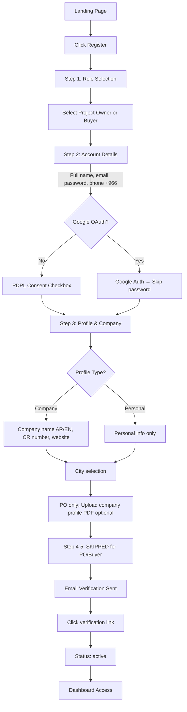

### 1.2 Contractor / Supplier — Starter Tier

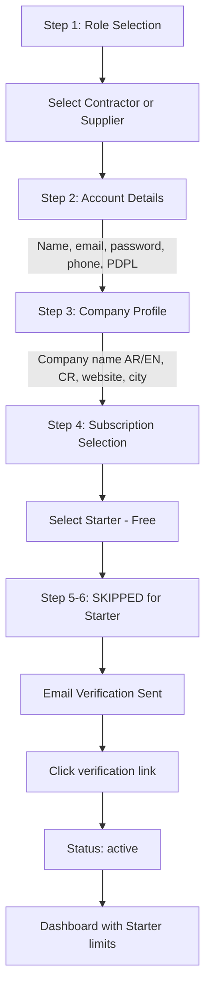

### 1.3 Contractor / Supplier — Pro / Business / Enterprise

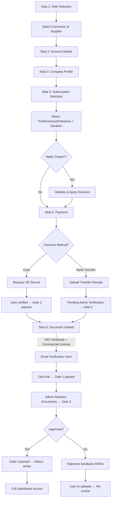

### 1.4 Google OAuth Registration

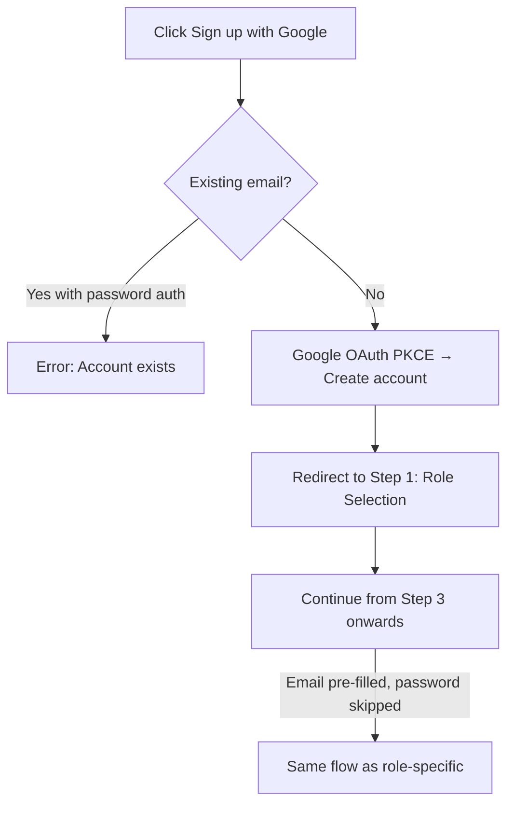

---

## 2. Login Flow

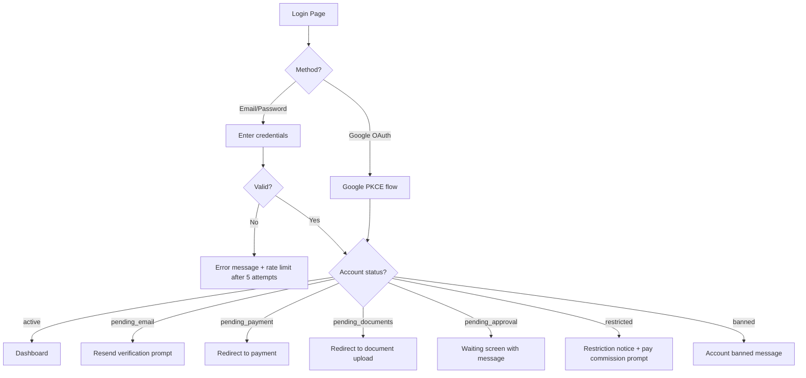

---

## 3. Project Lifecycle (Project Owner ↔ Contractor)

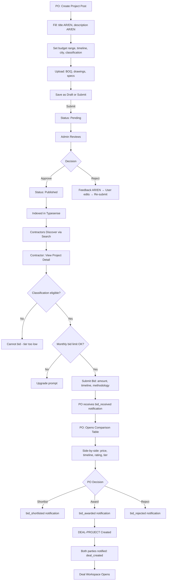

---

## 4. Product Procurement (Supplier ↔ Buyer/PO)

### 4.1 Product Inquiry Flow

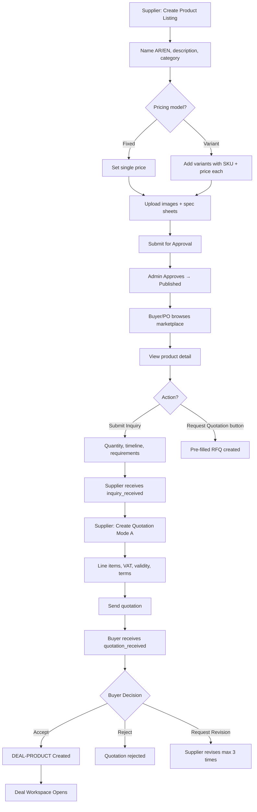

### 4.2 Standalone Quotation Flow

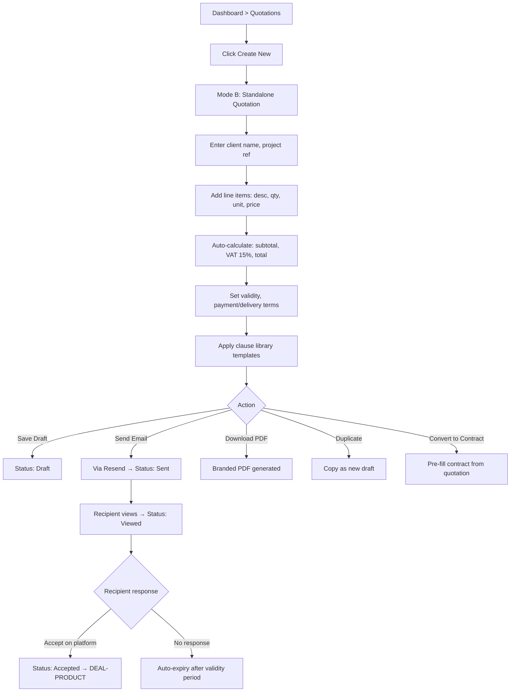

---

## 5. RFQ Flow (Any Role → Supplier)

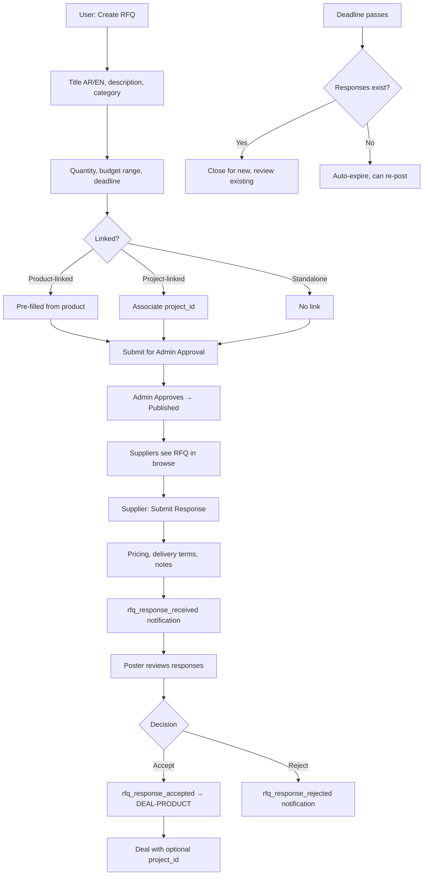

---

## 6. Direct Supplier Hire Flow

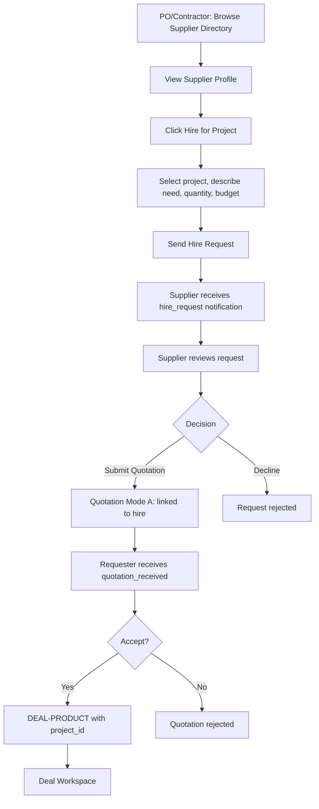

---

## 7. Deal Workspace Flow

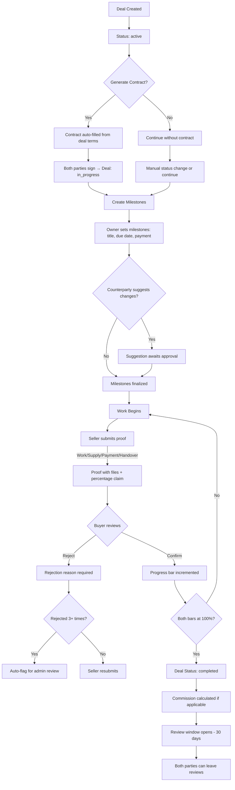

### 7.1 Deal Cancellation

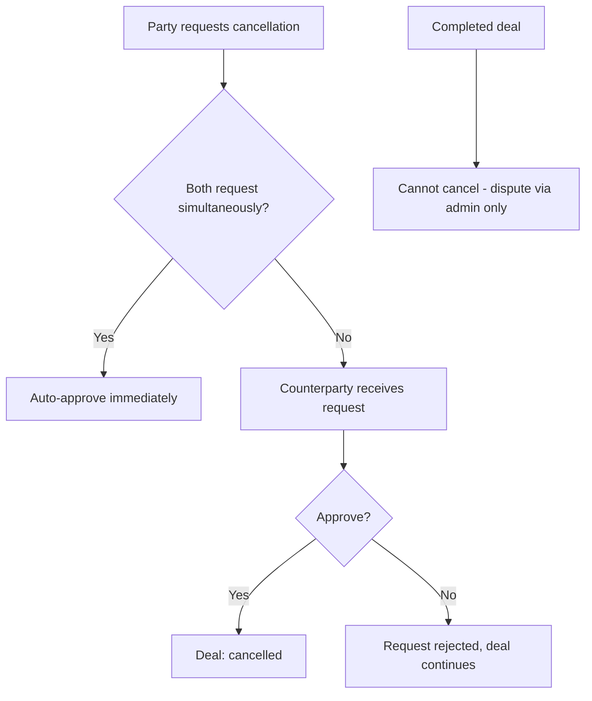

---

## 8. Kanban & Project Management Flow (Contractor)

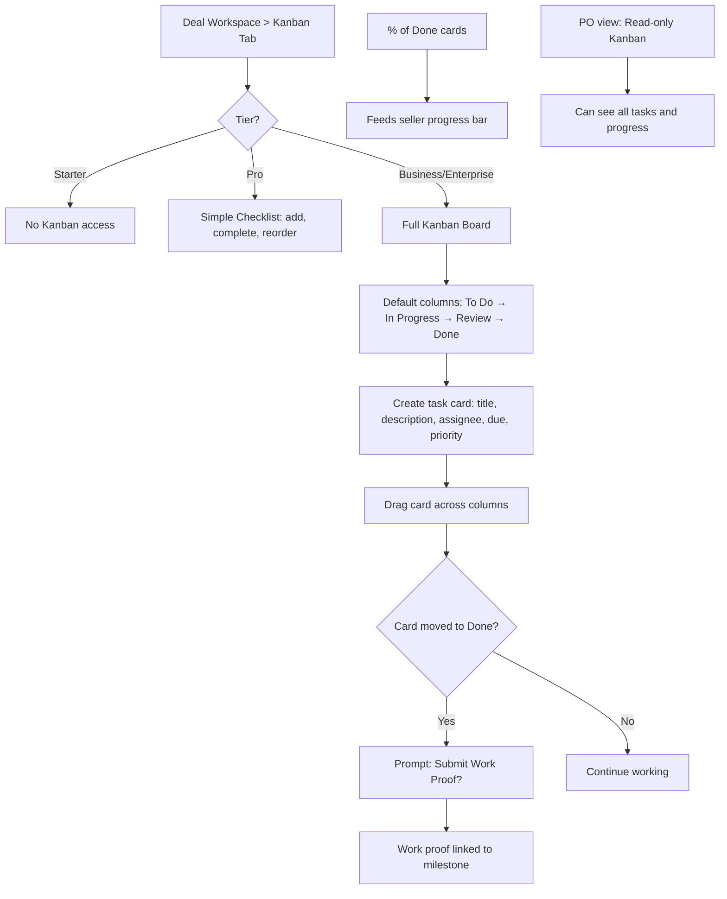

### 8.1 Daily Site Log

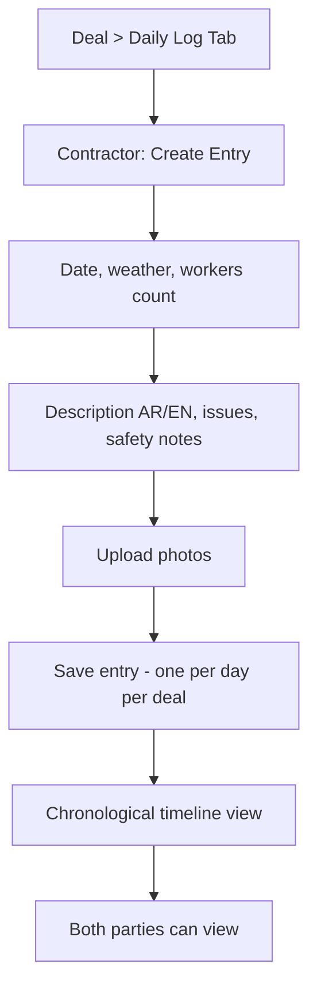

---

## 9. Contract Generator Flow

```mermaid
flowchart TD
    A{Entry point?}
    A --> |Standalone| B[Dashboard > Contracts > New]
    A --> |From Deal| C[Deal Workspace > Generate Contract]

    B --> D[Select template: Construction/Supply/Custom]
    C --> E[Auto-fill party info + deal terms]

    D --> F[Fill fields: parties, scope, payment, timeline]
    E --> F
    F --> G[Add clauses from library]
    G --> H[Preview bilingual layout]
    H --> I{Action}
    I --> |Save Draft| J[Status: Draft]
    I --> |Send to counterparty| K[Status: Sent]
    K --> L[Party A signs: name, title, date]
    L --> M[Party B signs: name, title, date]
    M --> N[Status: Signed]
    N --> O[QR code generated]
    O --> P[PDF with signatures + QR]
    P --> Q[Stored in deal Document Vault if linked]

    R[/verify/contract/uuid] --> S[Public verification page]
    S --> T[Shows: exists on platform + signing timestamps]
```

---

## 10. Subscription Management Flow

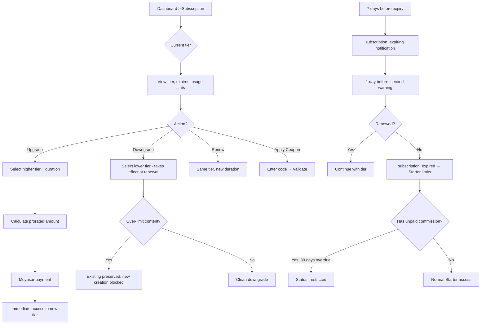

---

## 11. Commission Payment Flow

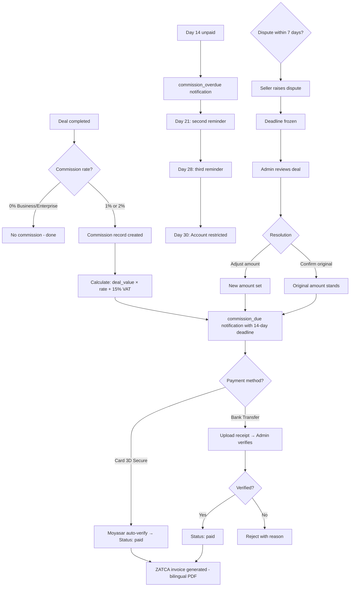

---

## 12. Review Flow

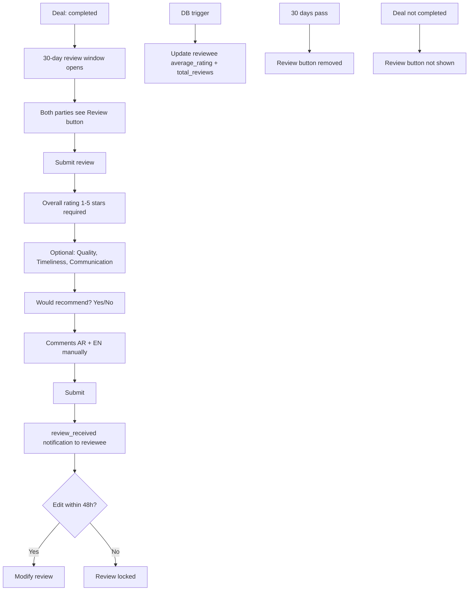

---

## 13. Search & Discovery Flow

```mermaid
flowchart TD
    A[User enters search query] --> B[API route /api/search]
    B --> C{Typesense available?}
    C --> |Yes| D[Query Typesense index]
    C --> |No| E[Fallback: PostgreSQL pg_trgm + to_tsvector]

    D --> F[Results with facets]
    E --> F

    F --> G[Display results with filters]
    G --> H{Filters}
    H --> |Category| I[Faceted filter]
    H --> |Price range| J[Range filter]
    H --> |Rating| K[Rating threshold]
    H --> |City| L[Saudi city filter]
    H --> |Sort| M[Recent / Rated / Price / Bids]

    N[Post published] --> O[DB webhook fires]
    O --> P[/api/webhooks/typesense-sync]
    P --> Q[Upsert document in index]

    R[Post unpublished/rejected] --> S[Remove from index]
```

---

## 14. Admin Moderation Flow

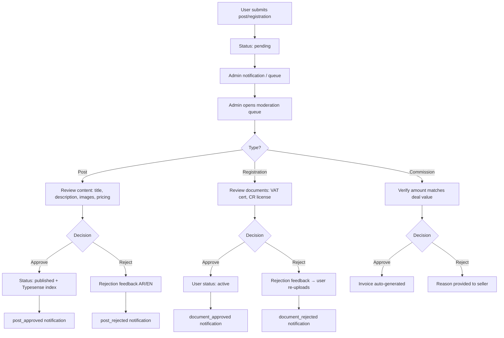

---

## 15. Messaging Flow

```mermaid
flowchart TD
    A{Entry point} --> |From project| B[Conversation linked to project]
    A --> |From product| C[Conversation linked to product]
    A --> |From deal| D[Conversation linked to deal]

    B --> E[Open conversation]
    C --> E
    D --> E

    E --> F[Type message]
    F --> G{Attach file?}
    G --> |Yes| H[Upload max 10MB]
    G --> |No| I[Send message]
    H --> I
    I --> J[Supabase Realtime delivery]
    J --> K[Recipient sees message instantly]
    K --> L[Unread count incremented]

    M[Recipient opens conversation] --> N[Mark as read]
    N --> O[Unread count reset]

    P[Soft delete] --> Q[Hidden for deleting user only]
```

---

## 16. Onboarding Flow (Example: Contractor)

```mermaid
flowchart TD
    A[First login] --> B[Onboarding checklist appears in sidebar]
    B --> C[Step 1: ✅ Email verified - auto-complete]
    C --> D[Step 2: Complete company profile]
    D --> |Click| E[Redirects to /dashboard/profile]
    E --> F[Step 3: Upload verification docs Pro+ only]
    F --> |Click| G[Redirects to document upload]
    G --> H[Step 4: Browse available projects]
    H --> |Click| I[Redirects to /projects]
    I --> J[Step 5: Submit first bid]
    J --> |Click| K[Redirects to project detail]
    K --> L[Step 6: Set up CRM]
    L --> |Click| M[Redirects to /dashboard/crm]
    M --> N[Step 7: Explore contracts]
    N --> |Click| O[Redirects to /dashboard/contracts]

    P[Progress: X/7 shown as badge]
    Q[80% complete → checklist dismissible]
    R[Contextual tooltips on first page visit]
```
